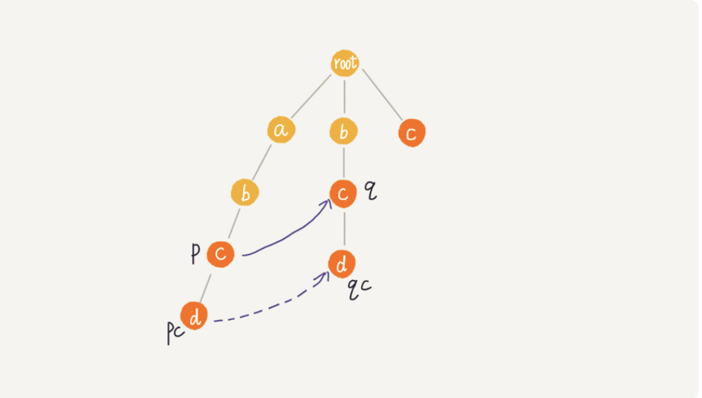
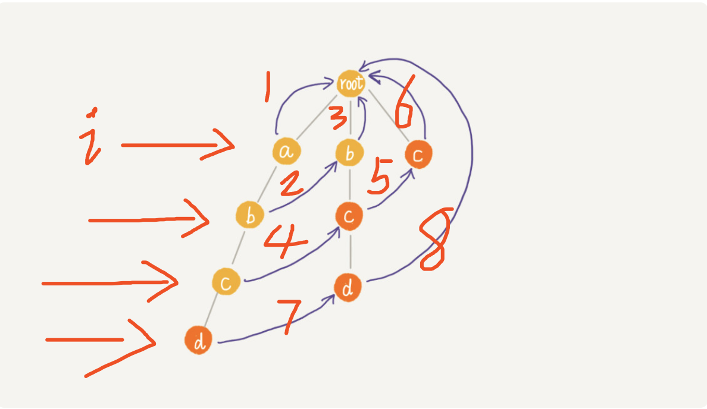

## AC自动机字符串匹配算法解析

> 是一个多模式的字符串匹配算法，其核心的失败指针的构建方法和KMP算法类似。只不过改成了树的表示形式

包含两个主要的操作：
- 将多个模式串构建成`Trie`字典树
- 初始化该字典树所有节点的失败节点(类似KMP的失效next数组，在ac中指的是，从根节点到该节点构成的字符串匹配所有模式串的最长后缀子串即为该节点的fail节点)
- 查找所有匹配的模式串索引下标和长度
### 构建字典树
> 就是`Trie`字典树的构建方式，只不过相比`Trie`树多了失败字段和模式串总长度字段

- 基本节点属性
```
    static class AcNode {
        private char val;
        private AcNode[] childArr;
        private int length = -1; //为模式串的长度
        private boolean isEndingCharacter = false; //是否是子叶节点
        private AcNode fail;

        public AcNode() {
            this.childArr = new AcNode[26];
        }

        public AcNode(char val) {
            this.val = val;
            this.childArr = new AcNode[26];
        }
    
    //省略了getter setter..
}
```
- 构建字典树
```
    public void buildTrieTree(List<String> listStr) {
        //遍历所有的模式串
        for (String s : listStr) {
            AcNode tmp = this.root;
            int length = 0;
            char[] chars = s.toCharArray();
            //逐个遍历字符若还没有包含字符，那么创建新的AcNode并赋值给对应的childArr[c-'a']
            for (char c : chars) {
                int i = (int) (c - 'a');
                if (tmp.childArr[i] == null) {
                    AcNode newNode = new AcNode(c);
                    tmp.childArr[i] = newNode;
                }
                tmp = tmp.childArr[i];
                //每次遍历完都需要长度++
                length++;
            }
            //字符串遍历完，标记模式串的结束
            tmp.isEndingCharacter = true;
            //给总长度赋值
            tmp.length = length;
        }
    }
```

### 构建所有节点的`fail`节点
> 这个有点复杂，其实就是类似KMP算法的思想,如图所示，我们已经知道p节点的fail为q,那么当p的子节点pc所在字符值(假设为c)，当且仅当q.childArr[c-'a']不为null时，那么pc的fail节点即为qc.（这个模式和KMP一样，相当于我们求abcd的最长后缀，已经知道abc的最长后缀为bc，那么当pc =qc ==d的时候，bcd也就是abcd的最长后缀子串了。）




```
/**
     * 构建整个AC自动机所有节点的失败节点
     */
    public void buildFailurePointer() {
        Queue<AcNode> queue = new LinkedList<>();
        this.root.fail = null; // 根节点的失败节点为null
        queue.add(root);
        //层序遍历，获取每个节点的失败节点。
        while (!queue.isEmpty()) {
            AcNode p = queue.remove();
            //遍历获取每个子节点的失败节点
            for (int i = 0; i < 26; i++) {
                AcNode pc = p.childArr[i];
                //为null继续拿下一个子字符元素
                if (pc == null) continue;
                //若为root，那么其子节点的失败节点就是root
                if (p == root) {
                    pc.fail = root;
                } else {
                    //获取其fail节点
                    AcNode q = p.fail;
                    //fail节点不为null的时候
                    while (q != null) {
                    		//求出pc(p的fail节点)的字符值对应的q中的子节点
                        AcNode qc = q.childArr[pc.val - 'a'];
                        //若存在则找到pc的fail节点qc
                        if (qc != null) {
                            pc.fail = qc;
                            break;
                        }
                        //若不存在，那么继续获取q的节点直到fail节点为null
                        q = q.fail;
                    }
                    if (q == null) pc.fail = root; //q为null的时候其fail失败节点就是root
                }
                //将子节点添加到队列中就行层次遍历。
                queue.add(pc);
            }
        }
    }
```


### 在字典树中查找所有匹配的子串

- 遍历主串`i∈[0,n-1]`，n为主串长度
- 获取i对应的子节点，若为空且当前根节点不是root，那么获取其fail节点继续判断
- 若不为空或者根节点为root，那么则替换为当前i对应的子节点
- 子节点直接判断是否是模式串结尾，如果是，那么则返回下标和长度
- 如果不是则继续获取fail节点进行操作。

> 整个操作过程和图类似。



```java
    /**
     * 从AC中匹配所有模式串，逐层向上匹配
     */
    public void match(char[] text) {
        int n = text.length;
        AcNode p = root;
        //遍历主串
        for (int i = 0; i < n; i++) {
            int idx = (int) (text[i] - 'a');
            //若子节点为null且不为root那么切换到其fail节点
            while (p.childArr[idx] == null && p != root) p = p.fail;
            //替换为子节点
            p = p.childArr[idx];
            //若没有匹配，那么从root开始
            if (p == null) p = root;
            AcNode tmp = p;
            while (tmp != root) {
                //当tmp为模式串结尾
                if (tmp.isEndingCharacter) {
                    int pos = i - tmp.length + 1;
                    System.out.println("匹配下标:" + pos + ", 长度 : " + tmp.length);
                }
                //获取树的上层最长前缀子串。
                tmp = tmp.fail;
            }
        }
    }
```


