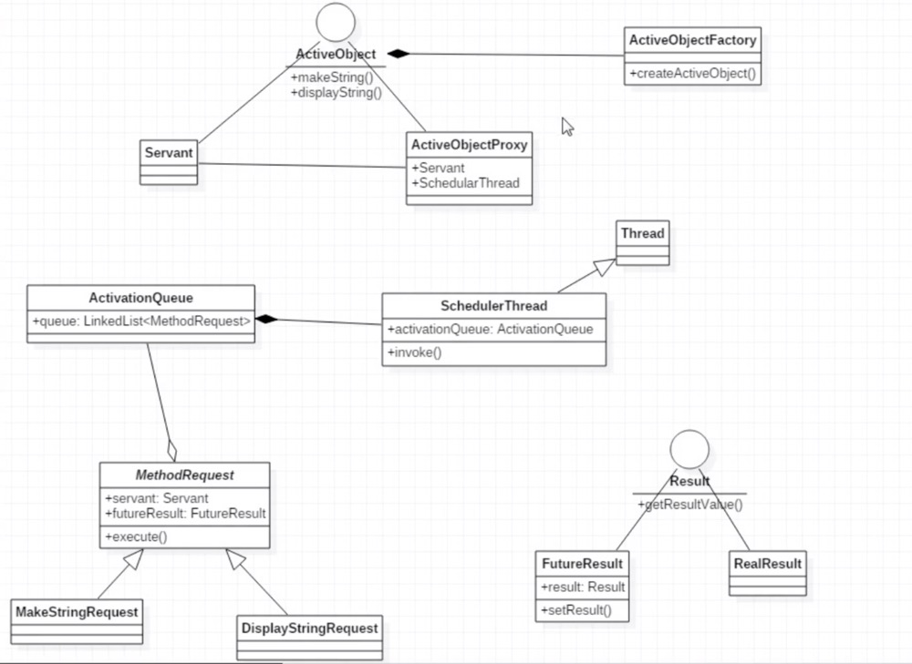

### ActiveObject模式

> 将线程任务的提交和调用分开，可以同时处理多个不同的任务，而Future只能同时处理一个
>且ActiveObject模式可以借助`ActivationQueue`来完成不同的`MethodRequest`,每个不同的`MethodRequest`
>对应`ActiveObject`中接受到的主动方法，`MethodRequest`通过注册到`ScheulerThread`中的`ActivationQueue`
>来进行异步调度，此时提交任务并不是立即执行，好比`System.gc()`标记之后有特定的`gc`线程来处理.

- ActiveObject类图

#### 调度步骤

- 使用`FutureResult`(Future模式标记对象，可以通过回调来获取返回)和`Servant`(真正执行业务)构造出对应的
`MethodRequest`
- 使用`ActiveObjectFactory`创建的`ActiveObjectProxy`将`MethodRequest`注册到`ActivationQueue`请求队列中，
并返回`FutureResult`对象
- 携带`ActivationQueue`的`SchedulerThread`会定时不断的去处理`ActivationQueue`中提交的请求，即执行`MethodRequest#execute()`
- `MethodRequest`调用最终执行者`Servant`完成请求任务的处理并通过`setResult`回调方法来通知`FutureResult`
