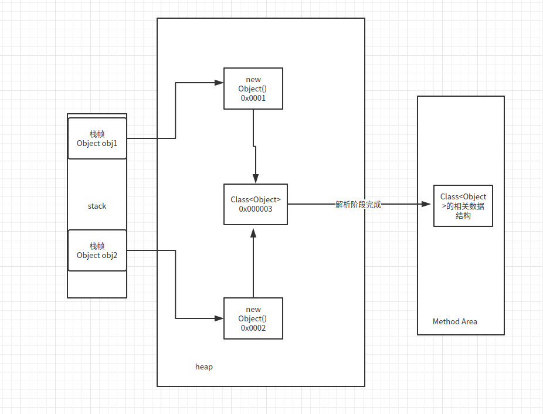

### 类加载器

> 加载二进制`.class`文件到内存中

#### 类的初始化过程
- 加载
> 将`.class`加载到内存中
- 链接
    - 验证
    > 验证字节码文件是否符合JVM规范
    - 准备
    > 给静态变量赋予初值
    - 解析
    > 将对象的符号引用变为直接引用
- 初始化
> 给静态变量初始化

#### JVM基本内存结构

- 方法区
> 储存类和对象的基本数据结构以及运行时常量池,为多线程共享
- 堆
> 储存引用对象的数据,为多线程共享
- 虚拟机栈
> 线程私有，包含多个栈帧(局部变量，方法出入口等..)
- PC寄存器(程序计数器)
> 包含线程私有的字节码指令执行情况
- 本地方法栈
> 类似虚拟机栈,只不过执行的为c/c++程序

---
> 创建一个对象的过程为,先加载该对象的Class文件到方法区中，同时在堆中生成一个Class对象，在解析过程中Class对象指向方法区中的Class对应的数据结构
> new一个对象的时候，会在堆中生成一个该对象的引用指向Class对象，同时虚拟机栈中的对象引用也会执行对应堆中实例对象

如图：


#### `ClassLoader的父委派机制`

> 我们在使用`JDK`自带的`ClassLoader`的时候是无法用本地的同包名同类名去优先于`JDK`自带的类的加载

  在`ClassLoader#loadClass`源码中会发现，他会优先使用`ParentClassLoader`加载
```
 protected Class<?> loadClass(String name, boolean resolve)
        throws ClassNotFoundException
    {
        synchronized (getClassLoadingLock(name)) {
            // First, check if the class has already been loaded
            //首先查看是否已经被加载了
            Class<?> c = findLoadedClass(name);
            if (c == null) {
                long t0 = System.nanoTime();
                try {
                    //如果没有被加载且parent不为null
                    if (parent != null) {
                        //使用父类加载器加载Class
                        c = parent.loadClass(name, false);
                    } else {
                        //父类加载器不存在则直接使用根类加载器加载
                        c = findBootstrapClassOrNull(name);
                    }
                } catch (ClassNotFoundException e) {
                    // ClassNotFoundException thrown if class not found
                    // from the non-null parent class loader
                }

                if (c == null) {
                    // If still not found, then invoke findClass in order
                    // to find the class.
                    long t1 = System.nanoTime();
                    //都没有加载到则使用自己的findClass来加载
                    c = findClass(name);

                    // this is the defining class loader; record the stats
                    sun.misc.PerfCounter.getParentDelegationTime().addTime(t1 - t0);
                    sun.misc.PerfCounter.getFindClassTime().addElapsedTimeFrom(t1);
                    sun.misc.PerfCounter.getFindClasses().increment();
                }
            }
            //解析Class
            if (resolve) {
                resolveClass(c);
            }
            return c;
        }
    }
```
#### `ClassLoader`的命名空间和运行时包

 ##### 命名空间
 如下，使用两个`ClassLoader`的不同实例对象去加载
```java
public class TestCustomClassLoader {
    public static void main(String[] args) throws ClassNotFoundException, IllegalAccessException, InstantiationException, InvocationTargetException, NoSuchMethodException {
        CustomClassLoader customClassLoader1 = new CustomClassLoader();
        CustomClassLoader customClassLoader2 = new CustomClassLoader();
        customClassLoader2.setDir("/Users/hujing/dd");
        Class<?> clazz1 = customClassLoader1.loadClass("com.concurrent.volatiles.VolatileTest1");
        Class<?> clazz2 = customClassLoader2.loadClass("com.concurrent.volatiles.VolatileTest1");
        System.out.println(clazz1.hashCode());
        System.out.println(clazz2.hashCode());
    }
}

```

 输出结果如下：
```
1173230247
856419764
```
> 所以不同实例的ClassLoader加载同一份`.class`文件会有不同的`Class`对象产生，这就是`ClassLoader`的命名空间

 ##### 运行时包
 如下，我重写了`ClassLoader`并修改父类委托机制，优先自己加载，此时将自己类加载器加载的实例对象强转会报`ClassCastException`，因为此时我们加载的`VolatileTest1`是带有运行时包的
 比如根类加载器`BootClassLoader`加载的全类名为`Boot.Ext.App.xxx.xxx.xxx.VolatileTest1`是无法强转为`xxx.xxx.xxx.VolatileTest1`的。
```java
public class PriorityClassLoaderTest {
    public static void main(String[] args) throws IllegalAccessException, InstantiationException, ClassNotFoundException {
        PriorityChildClassLoader priorityChildClassLoader = new PriorityChildClassLoader();
        final Class<?> clazz = priorityChildClassLoader.loadClass("com.concurrent.volatiles.VolatileTest1");
        //这里因为类加载的运行时包，由子类加载器加载的 VolatileTest1 是无法强转为 AppClassLoader的 ， 因为命名空间也不一样
        final VolatileTest1 volatileTest1 = (VolatileTest1) clazz.newInstance();
    }
}
```

#### 线程上下文类加载器
> 可以认为是`JDK`对`JDBC`,`JNDI`等`SPI`统一接口加载类时候开的"后门",因为面对不同厂家的实现,因为`JDK`的父类委托机制,是无法使用`BootStrapClassloader`来加在
>对应厂商的驱动实现类,一般我们会导入jar然后通过`Thread.currentThread().getThreadClassLoader()`来获取当前应用上下文的类加载器来加载，默认为`AppClassLoader`,
>即加在我们类路径下的`Driver`,那么为什么需要使用线程上下文类加载器呢? 因为我们的驱动类信息可能来源于网络或者其他非类路径的位置，我们需要自定义`ClassLoader`去加载，然后
>通过`Thread.currentThread().setThreadClassLoader`即可使用我们自己的类加载器去加载不同厂商的`Driver`.
