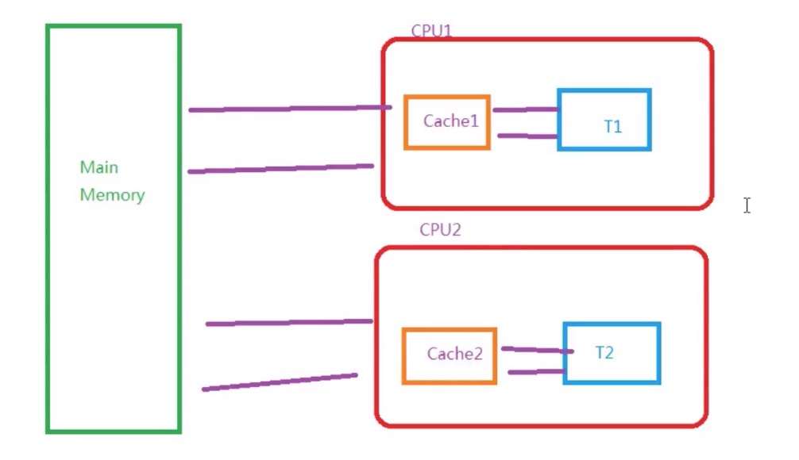

### Java基本内存模型

---



> 如图，Java应用程序通常将数据和对象放置在Main Memory里面，然而相比高速CPU来说，内存速度远不及，
>所以在中间设置了CPU Cache层，CPU会将计算的结果放置在里面，然后主存进行同步，不同的线程会有不同的cache

- 所以在Java会自作聪明的在只读的操作里面不进行主存同步，此时需要使用`volatile`来实现数据可见性
- 且在执行Java指令的时候，jvm会自己进行指令重排的优化，此时可能会导致在多线程环境下的初始化不一致，使用`volatile`可以解决，并且在CPU中有happends-before原则。比如读会在写之后。
```
-----Thread-1 --------------
Object obj = createObj();
boolean flag = true           //此时可能指令重排导致obj还没初始化就进行相关操作

-----Thread-2 --------------

while(flag){

 // do something about obj
}

```

#### 并发编程的三要素

- 原子性

    Java中对基本数据结构的变量读取和赋值是保证了原子性的，这些操作不可中断
    
``` 
    
 a =10; //原子性
 b =a;  //非原子性   1. read a 2. set b =a
 c++;   //非原子性   1.read c 2 add 1 3 write c
 c = c+1; //非原子性
```

- 可见性

```
volatile boolean flag = false; 

//读线程
while(flag){
    // do something
}

//写线程
new Thread(()->{
    //修改状态，加了volatile会使得读线程的缓存失效，从而执行里面的方法
    flag = true
}).start();
```

- 有序性
    
   通过拒绝指令重排来完成
