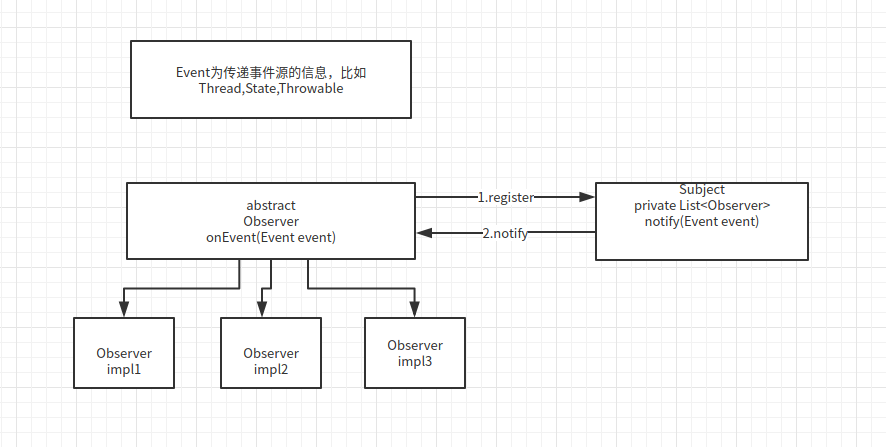

### 观察者模式

- Subject/Observable
> 事件源或者叫被观察对象
- Observer
> 观察对象或者叫监听者
- Event
> 触发监听的事件，非必须

---
#### 常见交互模式

- 观察对象注册到事件源
- 当发生对应的事件的时候事件源会直接通知观察者对象
- 可以使用`Event`来传递信息

[Demo源码实例](../src/main/java/com/concurrent/design/observer)