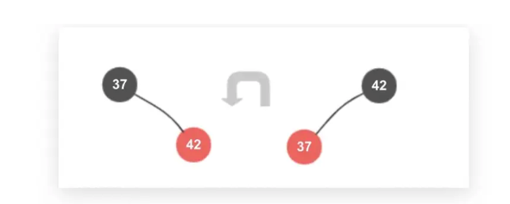
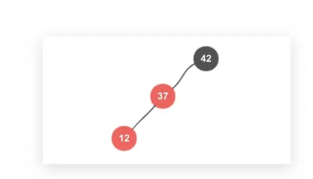
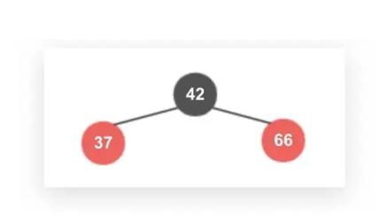
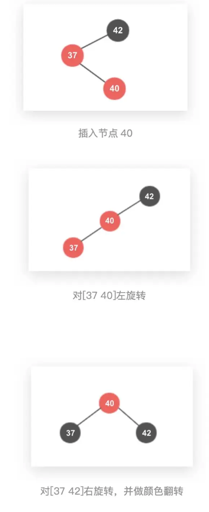
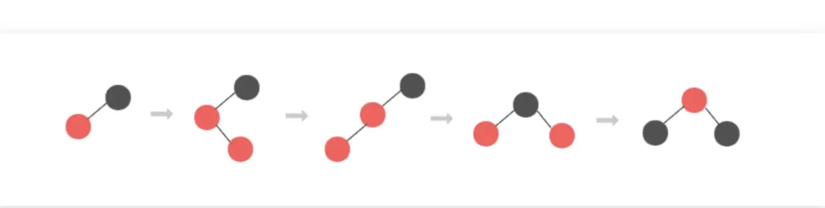

## 红黑树笔记

> 是2-3树的正规而叉查找树实现，由于2-3树的2，3节点分别需要存储大量的元素和子节点链接，所以使用红黑树来用常规二叉树规则实现。其中每个节点都是2节点。红色节点和其父节点组成一个三节点，三节点只能是左链接。因为实现规定的红黑树默认将三节点中的左节点当做红色节点。

#### 定义

- 根节点必须是黑色
- 红色节点不能连续
- 任意根节点到其所有子节点的路径上面的黑色节点数量相同
- 所以的叶子节点都是黑色（不存储数据）

#### 插入的几种情况

> 插入的节点默认为红色，因为新加入的节点刚开始融合的时候是平级关系，上面三节点的构成也是一黑一红。

- 插入根元素： 插入之后将节点颜色改为`red`
- 插入2节点`a`的左子树：`a.left = newNode`
- 插入2节点`a`的右子树： 违反了3节点的顺序，需要进行左旋，并将节点颜色互换。



因为这里翻转的节点可能含有子节点。所以需要完成子节点互换

```java
37 -> parent   42 -> child
  
  parent.right = child.left;
  child.left = parent;
  child.color = parent.color;
  parent.color = RED;
```

- 插入3节点的最左侧,比如途中的`12`，那么此时在`2-3`树中对应的为4节点，则需要分裂成二叉树，对应红黑树这种情况则要对`42`节点进行右旋然后互换37和42颜色即可



```java
37->child 42->parent
  
parent.left = child.right;
child.left = parent;
child.color = parent.color;
parent.color = RED;
```

- 插入的节点大于3节点最大元素，如图，插入元素为66，此时需要翻转颜色即可



```java
37.color = 66.color = 42.color
42.color = RED;
```

- 插入元素在3节点两元素中间，此时则需要先左旋40，然后右旋42，最后翻转所有节点颜色即可



#### 总结插入：

设a为初始黑色节点，b为初始红色节点



- 插入>a,则直接跳到第四张图，完成颜色翻转即可
- 插入<b，则直接跳转到第三图图，完成祖父节点右旋+翻转颜色即可
- 插入a<?<b，则完整的进行完左旋排序4节点，右旋分裂4节点成二叉树，最后翻转颜色，继续向上合并

另外一种方式：（将翻转节点操作单独合并出来一种操作，感觉这种方式更加合理，极客时间老师也是这种方式）

- 插入时，父节点和叔叔节点都是红色则翻转父节点，叔叔节点和祖父节点（将插入时的翻转操作放到这个时候操作）
- 插入时，叔叔节点为黑，且为父节点的右节点，那么如图第二张图，进行左旋+右旋
- 插入时，为父节点的左节点，那么如第三张图。