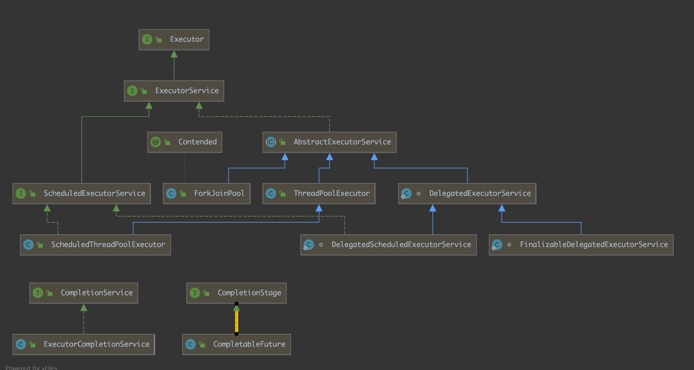

### 线程池相关

- [Executor](#Executor)
- [ExecutorService](#ExecutorService)
- [ThreadPoolExecutor](#ThreadPoolExecutor)
- [Executors](#Executors)
- [ScheduledExecutorService](#ScheduledExecutorService)
- [Future](#Future)
- [CompletionService](#CompletionSerivce)
- [CompletableFture](#CompletableFuture)
- [组件演示代码](../src/main/java/com/concurrent/juc/threadpool)

基本的类图如下所示



#### `Executor`

> 只提供一个`execute(Runnable task)` 方法来接受任务，具体任务怎么直接看子类实现

#### `ExecutorService`

> 在`Executor`上添加了一些关闭和执行任务的遍历方法，并且引入的`Fture`模式。

#### `AbstractExecutorService`

> ExecutorService的简单实现，其中对Runnable/Callable进行了包装成`FutureTask`

#### `ThreadPoolExecutor`

> 线程池的核心实现，其中核心包括`Work Thread`，`keepAliveTime`, `TaskQueue(BlockingQueue)`,`RejectPolicy`,`ThreadFactory`等核心属性

```java
        /**
         * 下面七个主要的线程池参数
         * int corePoolSize,  核心线程数量
         * int maximumPoolSize, 最大worker线程数量
         * long keepAliveTime,  超出核心线程的线程空闲时间
         * TimeUnit unit,   时间单位
         * BlockingQueue<Runnable> workQueue, 任务队列，里面使用显示锁+Condition实现了阻塞队列
         * ThreadFactory threadFactory, 线程工厂
         * RejectedExecutionHandler handler 拒绝策略
         */
        ThreadPoolExecutor threadPoolExecutor = new ThreadPoolExecutor(
                1, 2, 30, TimeUnit.SECONDS,
                new ArrayBlockingQueue<>(1),
                new MyThreadFactory(),
                new ThreadPoolExecutor.AbortPolicy() //拒绝策略
        );
```

注意点：

- `CorePoolSize` : 在通常情况下是不会被回收的，即使是空闲状态，除非设置了`threadPoolExecutor.allowCoreThreadTimeOut(true)`
- `maximumPoolSize` : 只有在`CorePoolSize`全部都在任务且`TaskBlockingQueue`任务满了才会创建新的线程
- `keepAliveTime` ： 空闲回收时间，会收回在`CorePoolSize -> MaximumPoolSize` 之间的空闲线程
- `BlockingQueue` : 阻塞的任务队列，没有任务会阻塞，任务满了也会阻塞，里面的实现用的是显示锁+`Condition`
- `ThreadFactory` : 可以自定义`WorkerThread`的创建工厂，可以给里面的工作线程添加一些自己的策略，比如守护线程，设置捕捉任务线程异常的handler等。
- `RejectPolicy` ： 拒绝策略。自带的有四种：
  - `AbortPolicy` ： 直接拒绝
  - `DiscardPolicy` ： 直接吞掉，不给报错信息
  - `DiscardOldestPolicy` : `poll`掉任务队列中的最后一个，然后执行新任务
  - `CallerRunsPolicy` : 使用主线程来执行

| 常用方法                   | 用处                                                         |
| -------------------------- | ------------------------------------------------------------ |
| getActiveCount             | 获取到正在处理任务的线程                                     |
| shutdown                   | 非阻塞，打断空闲线程，然后执行完所有正在执行的Task           |
| shutdownNow                | 非阻塞，会打断所有线程，并且将所有的任务队列中的Task返回，那些正在执行的任务无法获取到 |
| allowCoreThreadTimeOut     | 设置为true允许回收空闲的核心线程                             |
| remove                     | 移除任务队列中的任务                                         |
| prestartCoreThread         | 激活一个核心。即使此时没有任务                               |
| beforeExecute/afterExecute | 在线程池执行方法的前后进行增强                               |
| invokeAny /invokeAll       | 阻塞的执行一批任务。可以通过返回的Future来取消或者中断       |
| getQueue                   | 可以获取到里面的任务队列来手动添加任务，前提是要有活跃的线程。 |

`关于shutdownNow()`无法返回被打断任务的解决办法：

可以在自定义的`Runnable`中使用一个`boolean flag `去标志结束，并且提供`isSucess`方法来判断。

然后在后面就可以通过如下方法进行获取所有的执行失败的任务

```java
callableList.stream().filter(c->!((MyCallable)c).isSuccess()).forEach(System.out::println);
```


####  `Executors`

> 提供了一些方便的工厂方法获取不同特性的线程池

| 工厂方法                               | CoreSize |      Maximum      | KeepAliveTime |       TaskQueue       |
| -------------------------------------- | :------: | :---------------: | :-----------: | :-------------------: |
| `newFixedThreadPool(int nThreads)`     |    n     |         n         |       0       | `LinkedBlockingQueue` |
| `newCachedThreadPool()`                |    0     | Integer.Max_Value |      60L      |  `SynchronousQueue`   |
| `newWorkStealingPool(int parallelism)` |  cpu*2   |         -         |       -       |      `WorkQueue`      |
| `newSingleThreadPool()`                |    1     |         1         |       0       | `LinkedBlockingQueue` |

#### `ScheduledExecutorService`

> 定时调度线程池，不像quartz/crontab 那样会准时调度任务，会被任务执行时间影响

- `Schedule(Runnable/Callable,long delay,TiemUnit)` ： 在`delay`时间延迟之后执行任务
- `scheduleAtFixedRate(Runnable,long initDelay,long period,TimeUnit)` : 在`delay`时间后第一次执行然后每隔`period`时间段执行一次（若任务执行时间大于period），那么会在任务执行之后立马执行
- `scheduleWithFixedDelay(Runnable r,long initDelay,long delay,TimeUnit)` : 在`delay`时间后第一次执行然后每隔`delay`时间段执行一次（且该执行是在每个任务执行后面叠加
- `setContinueExistingPeriodicTasksAfterShutdownPolicy(true)` : 设置为`true`的话，那么在线程池`shutdown`之后还是会继续执行任务调度
- `setExecuteExistingDelayedTasksAfterShutdownPolicy(true)` : 设置为`true`的话，那么`schedule()`在`shutdown`之后会继续执行

#### `Future`

> 是一种并发编程的设计模式，在提交异步任务之后立马返回一个future对象用来在以后获取到执行方法的返回结果

注意点：

- `get()`方法打断的是`caller`线程
- `get(long timeout)`超时之后任务还是会继续执行.
- `cancel(boolean mayInterruptIfRunning)` ： 如果为`true`将会打断正在运行的`Task`
- `cancel`之后的`Task`无法进行`get()`

`future`的缺点 : 

- 无法进行回调 ： `CompletableFuture`解决
- 再提交列表的任务的时候无法按执行时间顺序返回任务 ： `CompletableFuture/CompletionService`解决

#### `CompletionService`

> 内部提供一个队列来保存执行完的future对象，重写future的`done()`

- `take()`方法从队列中获取并移除一个元素，阻塞方法
- `poll()`非阻塞方法，且具有超时功能。

```java
public class CompletionServiceTest {
    public static void main(String[] args) throws InterruptedException, ExecutionException {
      //init some callable 
        List<Callable<Event>> callableList = Arrays.asList(
                () -> {
                    TimeUnit.SECONDS.sleep(5);
                    System.out.println("5 finished.");
                    return new Event("5", null);
                },
                () -> {
                    TimeUnit.SECONDS.sleep(4);
                    System.out.println("4 finished.");
                    return new Event("4", null);
                },
                () -> {
                    TimeUnit.SECONDS.sleep(6);
                    System.out.println("6 finished.");
                    return new Event("6", null);
                }
        );
        final ExecutorService executorService = Executors.newFixedThreadPool(2);
        final ExecutorCompletionService<Event> executorCompletionService = new ExecutorCompletionService<>(executorService);
  	//submit task to threadpool      
	callableList.forEach(executorCompletionService::submit);
				
      //从CompltionServuce中的Queue拿出future
        Future<Event> take = null;
        while ((take = executorCompletionService.take()) != null) {
            System.out.println(take.get().eventId);
        }
    }

    private static class Event {
        final private String eventId;
        final private String msg;

        private Event(String eventId, String msg) {
            this.eventId = eventId;
            this.msg = msg;
        }

        public String getEventId() {
            return eventId;
        }

        public String getMsg() {
            return msg;
        }
    }
}
```

#### `CompletableFuture`

> 是jdk1.8中对于之前`future`不足的改进，提供的大量函数式接口去组合我们的任务，并且具有完成回调机制。是线程池和`future`的结合体，底层使用`ForkJoinPool`实现的。

核心方法：

- `Create CompletableFuture Method`:

  - `supplyAsync(Supplier)` : 提交一个`Supplier`
  - `runAsync(Runnable r) ` ： 提交一个`Runnable`
  - `anyOf(CompletableFuture..futures)`  : 阻塞的完成任意执行其中一个并且返回`CompletableFuture<Object>`
  - `allOf(CompletableFuture...futres)` : 阻塞的完成所有任务并返回一个`CompletableFuture<Void>`
  - `completablFuture(T t)` ： 返回一个`CompletableFuture<T>`

- `transfer Method`

  - `thenAccept(Consumer)` : 消费一个对象
  - `thenApply(Function)` ： 中转一个对象
  - `thenRun(Runnable r) ` : 最后执行一个`Runnable Task `
  - `handler(BiFunction<T,Throwable>) ` : 相比于`thenApply` 来说可以获取到异常。
  - `whenComplete(BiConsumer<T,Throwable>)` : 完成这阶段的时候进行调用消费值和获取到异常

- `Compose Method`

  - `thenAccpetBoth(CompletableFuture other,BiConsumer)` : 同时执行两个任务并且最后消费者两个任务返回值
  - `accpetEither(CompletableFuture other,Consumer)` : 同时执行两个任务，执行完毕一个任务之后会将返回值进行Consumer，另外一个任务也会得到执行
  - `applyToEither(CompletableFuture other,Function)` : 同时执行两个任务，执行完毕一个任务之后会将返回值进行Function，另外一个任务也会继续执行。
  - `runAfterBoth(CompletablFuture other,Runnable r)` ： 同时执行两任务，都执行完毕之后调用`Runnable task`
  - `runAfterEither(CompletablFuture other,Runnable r)` : 同时执行两个任务，执行完毕一个任务之后会调用`Runnable Task`，另外一个任务也会得到执行
  - `thenCombiner(CompletablFuture other,Bifunction f)` : 同时执行完毕，进行`BiFunction`
  - `thenCompose(Function<T,CompletablFuture)` : 前一个`CompletableFuture`的返回值充当第二个的入参

- `terminal Method`

  - `getNow(T value)` : 如果future没有结束则返回value。结束则返回future的返回值或者抛出异常。
  - `join()` : 会将`future#get()`的 `checked exception`转化为`unchecked execption`,更方便进行函数式编程
  - `complete()` 提交设置值，如果任务还未执行成功，那么`future#get()`将获取到其设置的值，执行成功后再设置值则提交失败
  - `completeExceptionally()`： 设置完成时异常，只有完成的时候才能通过`future#get()`获取到值，否则直接抛出异常
  - `exceptionally()` ： 处理`future`发生异常逻辑
  - `obtrudeValue()/obtrudeException()` : 执行设置值获取异常