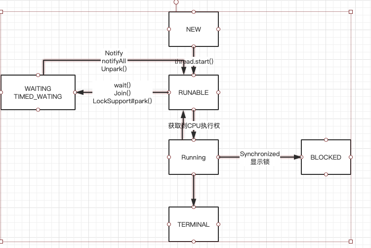

### Thread和runnable的关系
#### runnable是什么？为什么有了Thread还需要Runnable对象？为什么我们重写的是run()方法，却还是要调用start()方法来启动线程呢？

`Runnable`是使用了类似策略模式将一个线程中要实现的业务代码和业务参数都提取到了一个`Runnable`类中，`Thread类`中会判断传入的`Runnable`是否为空，不为空则会调用在调用`start()`方法的时候，被`native`方法的`start0()`回调`Thread#run()`中调用`Runnable target #run()`,如下面代码块所示

```
    public void run() {
        if (target != null) {
            target.run();
        }
    }
```

#### Thread线程的状态以及其中的切换示意图



#### Thread中用到的策略模式,Thread通过传入不同的runnable对象来完成不同的线程任务调度，其中传入的runnable对象相当于传入不同的策略模式对象

#### Thread构造方法中的细节
- ThreadGroup，不传递默认是父线程的ThreadGroup对象
- ThreadName , 线程的名字不传递的话默认为Thread-"一个从0递增的数字"
-  stackSize , 值得是该线程可拥有的最大虚拟机栈的大小 ,每个线程都有自己的虚拟机栈，但是JVM的栈内存的大小是固定的，所以通过调整线程的最大虚拟机栈来调节该线程可包含的内存大小

#### 守护线程
> 可以通过thread实例对象的deamon(boolean b)来设置，如果一个线程被申明为守护线程，那么该线程的主线程退出之后守护线程也会退出，可以用该特别来实现类似连接心跳的实现，当连接建立的时候后台线程定时调用发送心跳包，当连接死掉，心跳也随之结束

#### ThreadApI

- `join()` : 这个方法是用来阻塞父线程，等待子线程执行

```java
public class ThreadJoinDemo {
    public static void main(String[] args) throws InterruptedException {
        Thread t1 = new Thread(() -> {
            IntStream.range(1, 1000).forEach(System.out::println);
            System.out.println("child thread finish done.");
        });
        t1.start();
        t1.join(); //Main线程会等待t1结束之后再开始执行
        IntStream.range(1, 1000).forEach(System.out::println);
    }
}
```

- `interrupt()` : 这个方法用来中断被`sleep()`,`wait()`,`join()`,阻塞住的线程，并抛出`InterruptedException`异常
```java
public class ThreadInterruptDemo {

    private static final Object MONITOR = new Object();

    public static void main(String[] args) {
        Thread mainThread = Thread.currentThread();
        Thread t = new Thread(() -> {
            while (true) {
                }
        });

        //在join阻塞Main线程之后使用第二个线程中断join
        Thread t2 = new Thread(()->{
            try {
                //这里等待是避免还没开始join()就已经调用的interrupt()
                Thread.sleep(1000L);
                System.out.println(mainThread.isInterrupted());
                //中断Main线程的join阻塞
                mainThread.interrupt();
                System.out.println(mainThread.isInterrupted());
            } catch (InterruptedException e) {
                e.printStackTrace();
            }
        });
        t.start();
        t2.start();
        try {
            //阻塞Main线程等待t线程调用完毕
            t.join();
        } catch (InterruptedException e) {
            System.out.println("join interrupt");
            e.printStackTrace();
        }
        System.out.println("Main Thread Done..");
    }
}
```

#### 三种Thread的关闭退出

- 优雅关闭之借用flag

```java
public class ThreadCloseGracefulWithFlag {

    public static void main(String[] args) {
        Worker worker = new Worker();
        worker.start();
        try {
            //等待三秒，没执行完就打断
            Thread.sleep(3_000);
            worker.shutdown();
        } catch (InterruptedException e) {
            e.printStackTrace();
        }
    }
    private static class Worker extends Thread{

        private volatile boolean flag = true;

        @Override
        public void run() {
            while (flag) {
                //do something
            }
        }
        //修改执行flag
        private void shutdown(){
            flag = false;
        }
    }
}
```

  使用修改标记位来中断，是针对`run()`方法中需要循环调用某个事件，`shutdown()`改变标记位，使得这次事件结束后结束线程，这种方法只能作用于需要循环执行且单次执行耗时少的任务。
  
- 优雅关闭之`interrupt()`

```java
public class ThreadCloseGracefulWithInterrupt {
    public static void main(String[] args) {
        ThreadCloseGracefulWithInterrupt.Worker worker = new ThreadCloseGracefulWithInterrupt.Worker();
        worker.start();
        try {
            //等待三秒，没执行完就打断
            Thread.sleep(3_000);
            worker.interrupt();
        } catch (InterruptedException e) {
            e.printStackTrace();
        }
    }
    private static class Worker extends Thread{
        @Override
        public void run() {
            while (true) {
                //如果被打断就退出线程
                if (isInterrupted()) {
                    break;
                }
            }
        }
    }
}
```

  使用`interrupt()`来中断任务线程
  
- 直接关闭之使用守护线程

```java
/**
 * 针对使用中断的优雅关闭的方式，它的缺点是需要自身能够判断是否已经打断，而面对那种一个线程可能处理耗时任务无法自己判断
 *
 * 使用守护线程去执行任务，然后可以控制主线程来控制任务
 */
public class ThreadCloseForce {
    public static void main(String[] args) {
        ThreadService service = new ThreadService();
        long start = System.currentTimeMillis();
        service.execute(() -> {
            //模拟耗时任务
            while (true) {
            }
        });
        service.shutdown(3000);
        long end = System.currentTimeMillis();
        System.out.println("一共耗时 -> " + (end - start) + "ms");
    }

    private static class ThreadService {

        //执行任务线程
        private Thread executeThread;

        //该标志用来显示指明Task任务已经执行完毕了
        private boolean finished = false;

        void execute(Runnable task) {
            executeThread = new Thread(() -> {
                //使用守护线程来执行Task
                Thread t = new Thread(task);
                t.setDaemon(true);
                t.start();
                try {
                    //使用join来阻塞executeThread
                    t.join();
                    finished = true;
                } catch (InterruptedException e) {
                    System.out.println(executeThread.getName() + " = > interrupt");
                }
            });
            executeThread.start();
        }
        /**
         *  关闭方法
         * @param timeoutMillis  超时时间
         */
        void shutdown(long timeoutMillis) {
            long start = System.currentTimeMillis();
            while (!finished) {
                //如果没有成功，那么我们需要判断是否超时
                if ((System.currentTimeMillis() - start) >= timeoutMillis) {
                    //超时
                    System.out.println("任务超时。。。");

                    //打断阻塞的执行线程从而关闭Task
                    executeThread.interrupt();
                    return;
                }
            }
            finished = false;
        }
    }
}
```

  上面第二种的优雅关闭方法如果Runnable任务内部是一次耗时严重无法调用`isInterrupt()`方法，比如网络连接，读取一个大文件等耗时操作。
  那么如何使用外部方式来关闭正在处理的任务线程呢，前面我们学过守护线程的生命周期是随着主线程结束也随之结束。所以我们可以通过使用一个专门的`executeThread`来创建一个守护线程执行任务，后面在守护线程中使用`join()`阻塞`executeThread`等待执行结束，在`shutdown()`关闭方法中我们可以通过`interrupt()`方法随时中断`exectueThread`的阻塞来结束`executThread`从而提前结束守护线程。同时我们使用一个标志位`finished`来观测执行线程是否执行完毕，从而也可以兼顾执行线程正常结束的逻辑
